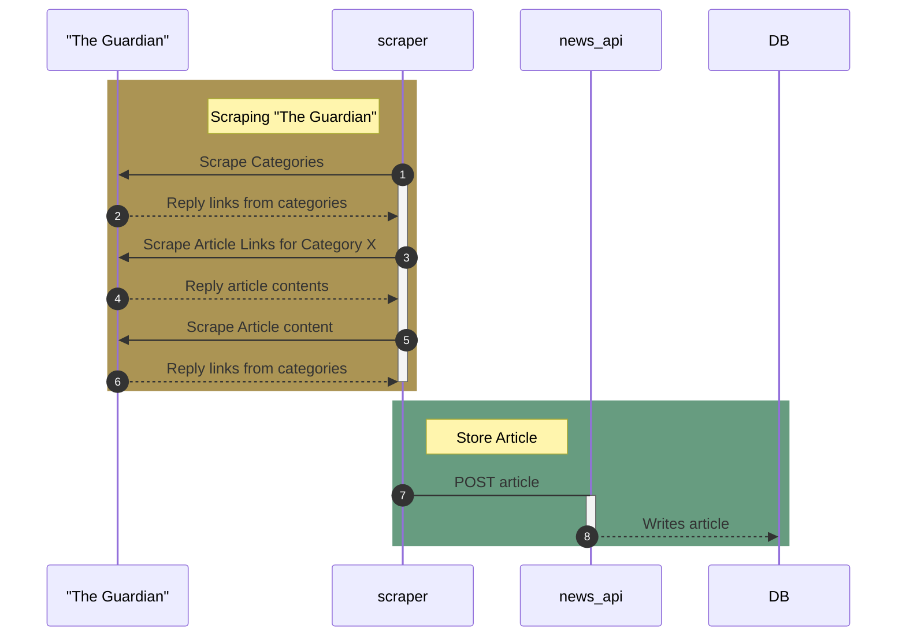
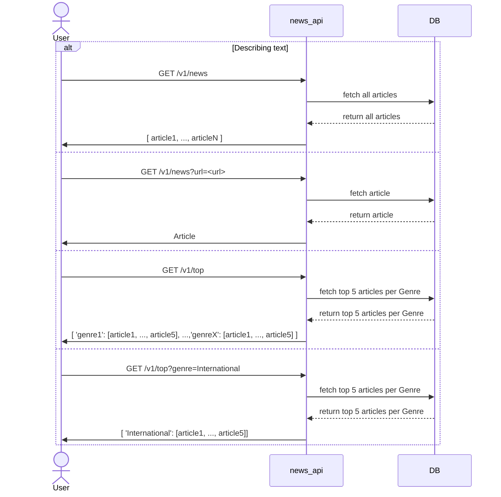

# News API Project
## Information
This project is an API that scrapes news articles and stores them in a Postgres database.
Since this is a POC we perform scraping from https://www.theguardian.com/ however, it is extensible to any news website by adding new spider(s).

## How it works: 
### Scraping Sequence Diagram



### Retrieving Articles Sequence Diagram


## Setup
Make sure to have docker and docker-compose installed locally.

1. Build the image:

    ```console
    docker-compose build
    ```

2. Run the News API, Postgres DB and PGAdmin
    ```console
    docker-compose up news-api
    ```

3. Run the scraper to retrieve news articles and populate DB 
    ```console
    ./scripts/scrape.sh 
    ```

4. To use the API , go to http://localhost:3000/docs#. To see API routes specifications, go to http://localhost:3000/openapi.json 


## Run Locally and Troubleshooting
### Use Scrapy locally: 

1. Install Scrapy: `pip install scrapy`
2. You can run scrapy shell for interactive console (A) or run the spiders locally directly (B)

A. Run scrapy shell for interactive console

Example: Get the links of all the news categories from theguardian.com
```bash 
>> fetch('https://www.theguardian.com/uk')
>> categories = response.css('ul.menu-group.menu-group--secondary')
>> links = categories.css('a.menu-item__title::attr(href)').getall()
```

B. Run the spiders locally directly
- Run the categories_spider.py: 
    ```bash
    scrapy runspider scraper/scraper/spiders/categories_spider.py -O scraper/scraper/output/categories.json
    ```
- Run the article_links_spider.py: 
    ```bash
    scrapy runspider scraper/scraper/spiders/article_links_spider.py -O scraper/scraper/output/article_links.json
  ```
  
- Run the article_spider.py: 
  ```bash
  scrapy runspider scraper/scraper/spiders/article_spider.py -O scraper/scraper/output/articles.json
  ```


### Access Postgres DB

To access the Postgres DB, there are 2 options

1. Using `psql` command line tool
    ```terminal 
    docker-compose exec db psql -U postgres -d mydatabase
    >> \dt
    >> SELECT * FROM articles;
    ```

2. Access Postgres DB using pgAdmin

- Open pgAdmin in your browser (http://localhost:5050)
- Add a new server
- Set the name to `db`
- Set the host to `db`
- Set the port to `5432`
- Set the username to `postgres`
- Set the password to `postgres`
- Click save


