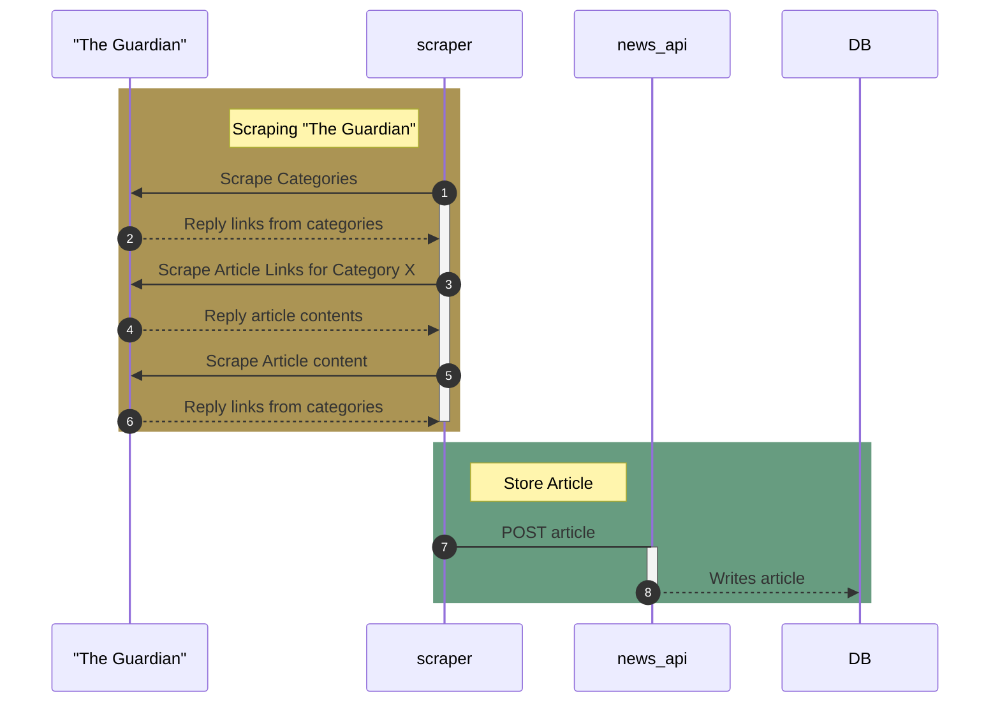
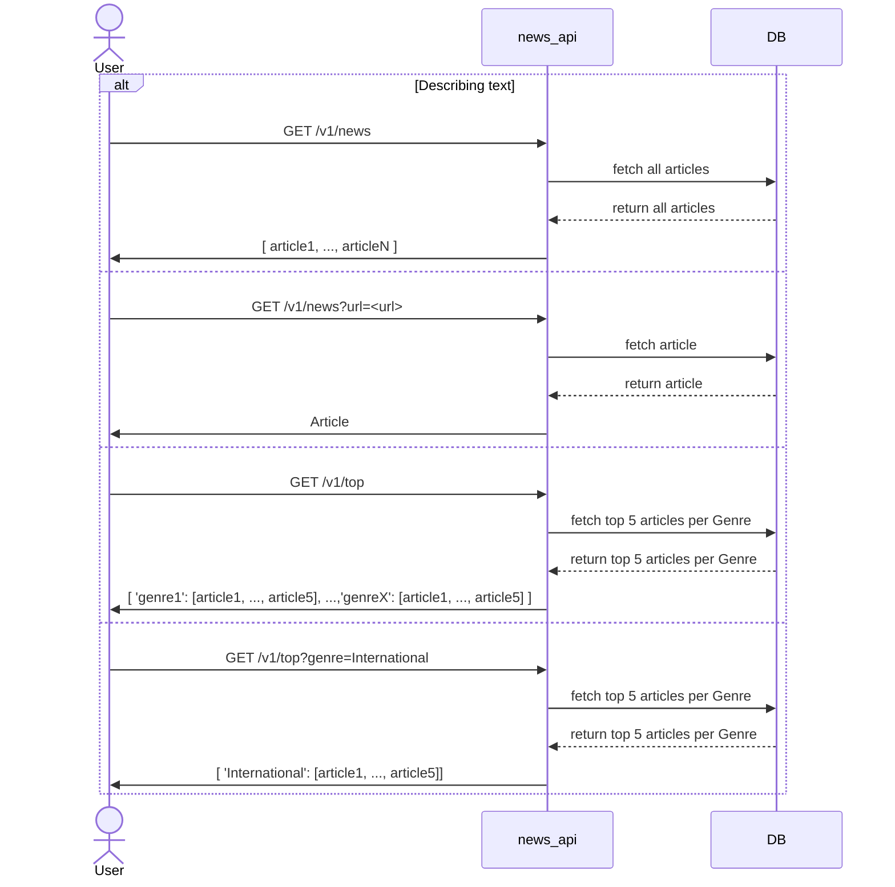

# News API Project
## Information
This project is an API that scrapes news articles and stores them in a Postgres database.
Since this is a POC we perform scraping from https://www.theguardian.com/ however, it is extensible to any news website by adding new spider(s).

## How it works: 

### Architecture

[Here is a drawing](https://drive.google.com/file/d/1F2lxAISzHAoTwCzsdDdGDDmCHDSpIQWt/view?usp=share_link) of the architecture of the solution.
There are 4 components:
- News-API service: Python Service using FastAPI + SQLAlchemy to manage communication with the DB.
- DB: PostgresSQL database 
- Scraper: Python Service using Scrapy framework to scrape news sites + News-API client to POST articles
- PGAdmin: To facilitate monitoring and work on the DB.

### Scraping Sequence Diagram

To scrape `The Guardian` we are performing 3 scrapes: 
1. Get all the categories (UK, World) from main page: https://www.theguardian.com/ 
2. Per Category (e.g. https://www.theguardian.com/world)scrape the links for all the articles in the page.
3. For every article link, crape article content

Once scraping is done, the Scraper is reaching `News-API` `POST` endpoint `v1/` and the article is stored to the DB. 




### Retrieving Articles Sequence Diagram
The user has 2 `GET` endpoint to use: 
1. Get All News: `GET` `/v1/all-news`
2. Get News by url: `GET` `/v1/news?news_link=<url>`

Find more information on the next section **__Setup__** > **__Step 6__**

Note: The 3rd GET route shown in the next sequence diagram is not yet released.



## Setup
Make sure to have docker and docker-compose installed locally.

1. Build the image:

    ```console
    docker-compose build
    ```

2. Run the News API, Postgres DB and PGAdmin
    ```console
    docker-compose up news-api
    ```
   
    Note: If the first time it fails with the below error: Stop and run the command again. 
    ```console
    sqlalchemy.exc.OperationalError: (psycopg2.OperationalError) could not connect to server: Connection refused
    news-api  |     Is the server running on host "db" (172.24.0.2) and accepting
    news-api  |     TCP/IP connections on port 5432?
    ```

3. [Optional]  To access the DB via PGAdmin execute: 
    ```console
    docker-compose up pgadmin
    ```
    
    Alternatively: Use of `psql`. 
    
    Find information on how to access the DB in the last section **Run Locally and Troubleshooting** subsection **Access Postgres DB**    


4. Run the scraper to retrieve news articles and populate DB 
    ```console
    ./scripts/scrape.sh 
    ```
    
    New json files have been created under: **scraper/scraper/output**
    If there is any issue, you can use backup files under **scraper/scraper/output/backup**


5. Populate the DB with the scraped articles via reaching out the **News-API POST route**: http://localhost:3000/v1/
    ```console
    ./scripts/post_articles.sh 
    ```
6. To use the API routes, go to http://localhost:3000/docs#. 
   Routes:
   1. **__Get All News__**: GET `/v1/all-news`:  http://localhost:3000/v1/news?limit=7&offset=0
   2. **__Get News by url__**: GET `/v1/news?news_link=<url>`:  http://localhost:3000/v1/news?news_link=<url>
   3. **__Store Article__**: POST `/v1/`:  http://localhost:3000/v1/
   4. [WIP] **__Get Top 5 for Genre__**: GET `/v1/news?genre=<genre>`:  http://localhost:3000/v1/news?genre=<genre>
   

## Run Locally and Troubleshooting


### Use `Scrapy` locally
   
   Steps:
   1. Install Scrapy: `pip install scrapy`
   2. You can run scrapy shell for 
      1. `shell` interactive console 
      2. run the spiders locally directly 


#### i. Run scrapy shell for interactive console

Example: 
Get the links of all the news categories from https://www.theguardian.com/

```bash 
    >> fetch('https://www.theguardian.com/uk')
    >> categories = response.css('ul.menu-group.menu-group--secondary')
    >> links = categories.css('a.menu-item__title::attr(href)').getall()
   ```


#### ii. Run the spiders locally directly
- Run the categories_spider.py: 
    ```bash
    scrapy runspider scraper/scraper/spiders/categories_spider.py -O scraper/scraper/output/categories.json
    ```
- Run the article_links_spider.py: 
    ```bash
    scrapy runspider scraper/scraper/spiders/article_links_spider.py -O scraper/scraper/output/article_links.json
  ```
  
- Run the article_spider.py: 
  ```bash
  scrapy runspider scraper/scraper/spiders/article_spider.py -O scraper/scraper/output/articles.json
  ```


### Access Postgres DB

To access the Postgres DB, there are 2 options

1. Access Postgres DB using pgAdmin

   - Open pgAdmin in your browser (http://localhost:5050)
   - Login with credentials: 
     - Email Address: admin@example.com 
     - Password: admin
   - Add a new server
   - General > Name: `db`
   - Connection > Host to `db`
   - Connection > Port to `5432`
   - Connection > Username to `postgres`
   - Connection > Password to `postgres`
   - Click save


2. Using `psql` command line tool
    ```terminal 
    docker-compose exec db psql -U postgres -d mydatabase
    >> \dt
    >> SELECT * FROM articles;
    ```